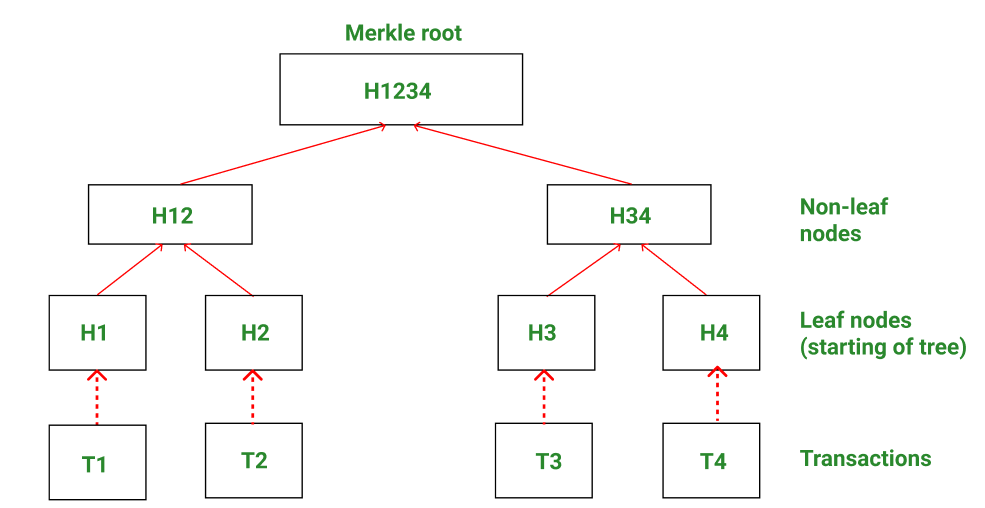

# Merkle-Tree
Merkle Trees are a tree-like structure where every node on the tree is represented by a value that is the result of some cryptographic hash function. 
Merkle trees nodes: 
1. Leaf node-> last node of the merkle tree and their value is hash of original data. 
2. Parent node -> their value is the result of the corresponding child node.
3. Root node -> stores merkle root hash.

This repo contains two main file: 
1. JS file which generates the merkle tree.
2. Solidity file which verify the merkle proof.
